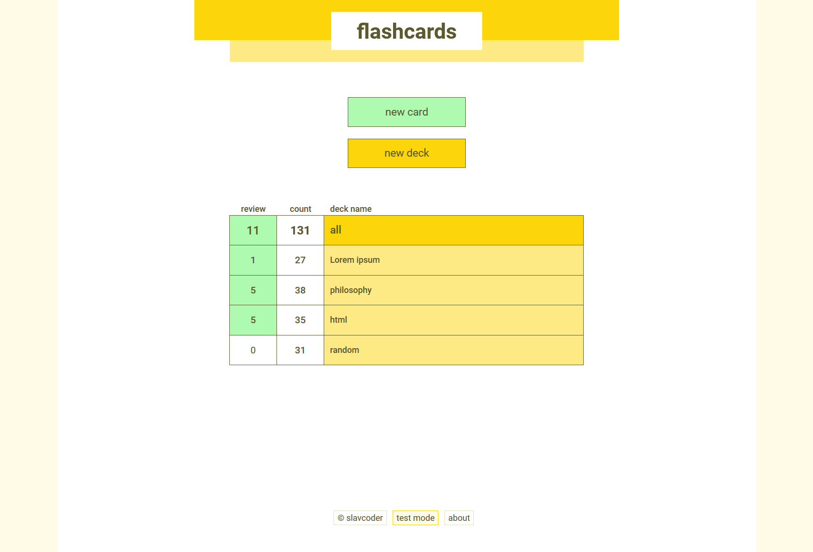
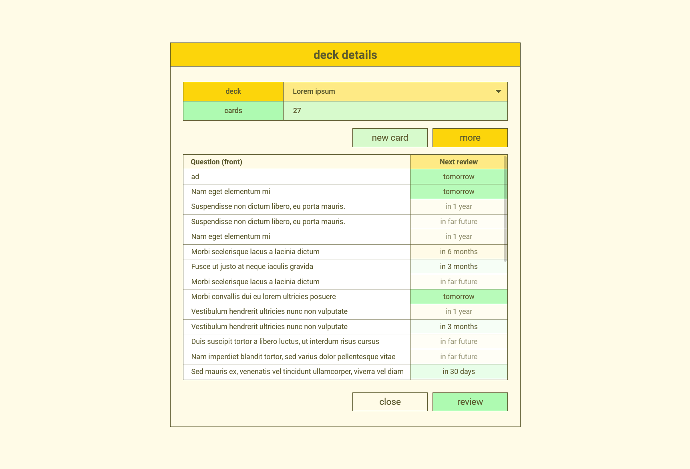
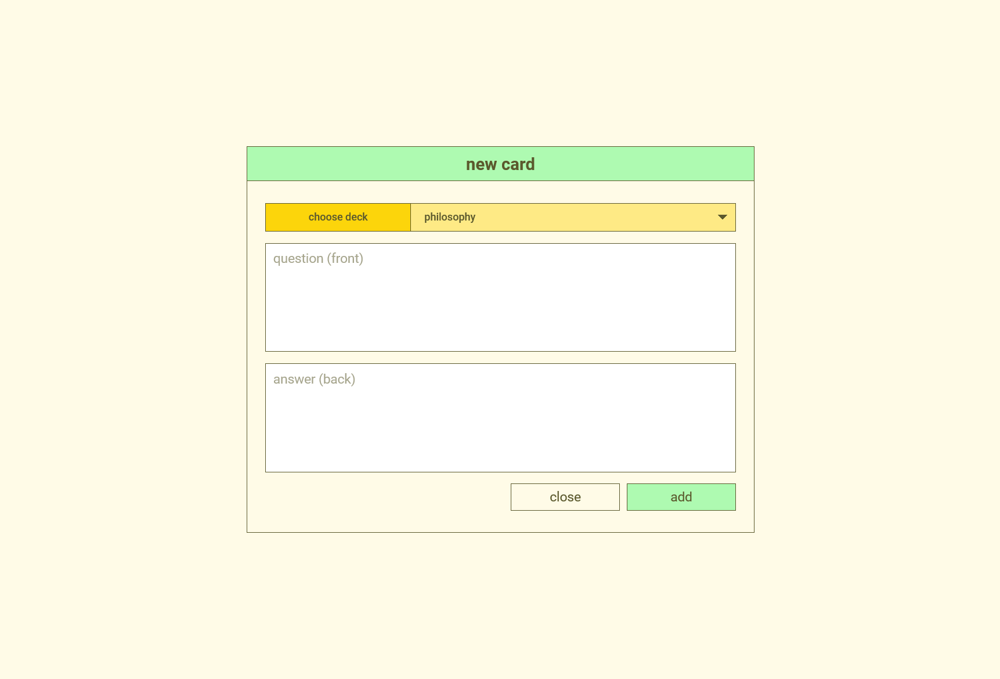
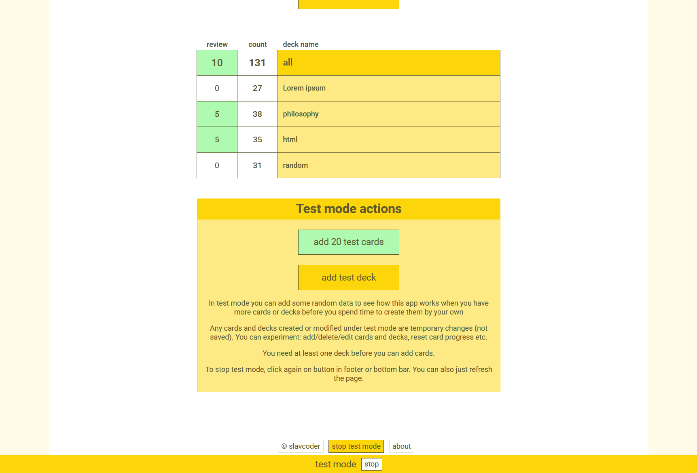

# Flashcards
**React app**

Popular flashcards in my simple design.

## Link to live version
[slavcoder.github.io/flashcards](https://slavcoder.github.io/flashcards)

## Features
- add/ delete/ edit card
- add/ delete/ edit deck
- review cards (next review date is based on how well you mastered this card)
- test mode (you can easy add random decks and cards with random next review date and other data)
- cards and decks are saved in localstorage for now (those created under test mode are not saved)

## Screenshots

")
")

